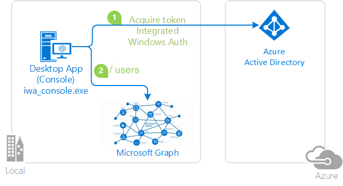

# Invoking an API protected by Microsoft identity platform with users signed-in with Integrated Windows Authentication, on a Windows domain joined or AAD joined machine

## About this sample

### Overview

This sample demonstrates how to use MSAL4J for apps running on a domain joined or AAD joined Windows machine that wish to authenticate using Windows Integrated Authentication  It enables these apps to:

- Authenticate the user signed-in on the Windows machine
- Call a web API (in this case, the [Microsoft Graph](https://graph.microsoft.com))



If you would like to get started immediately, skip this section and jump to *How To Run The Sample*.

### Scenario

The application obtains tokens through Integrated Windows Authentication (Kerberos):

- Developers who wish to gain good familiarity of programming for Microsoft Graph are advised to go through the [An introduction to Microsoft Graph for developers](https://www.youtube.com/watch?v=EBbnpFdB92A) recorded session.

## How to run this sample

To run this sample, you'll need:

- Working installation of Java and Maven
- An Azure Active Directory (Azure AD) tenant. For more information on how to get an Azure AD tenant, see [How to get an Azure AD tenant](https://azure.microsoft.com/documentation/articles/active-directory-howto-tenant/)
- One or more user accounts in your Azure AD tenant.

### Step 1: Download Java (8 and above) for your platform

To successfully use this sample, you need a working installation of [Java](https://openjdk.java.net/install/) and [Maven](https://maven.apache.org/).

### Step 2: Clone or download this repository

From your shell or command line:

```Shell
git clone https://github.com/Azure-Samples/ms-identity-java-desktop.git
cd "Integrated-Windows-Auth-Flow"
```

or download and extract the repository .zip file.

### Step 3:  Register the sample with your Azure Active Directory tenant

To register the project, you can follow the steps in the paragraphs below:

#### Choose the Azure AD tenant where you want to create your applications

As a first step you'll need to:

1. Sign in to the [Azure portal](https://portal.azure.com) using either a work or school account or a personal Microsoft account.
1. If your account is present in more than one Azure AD tenant, select your profile at the top right corner in the menu on top of the page, and then **switch directory**.
   Change your portal session to the desired Azure AD tenant.
1. In the portal menu, select the **Azure Active Directory** service, and then select **App registrations**.

> In the next steps, you might need the tenant name (or directory name) or the tenant ID (or directory ID). These are presented in the **Properties** of the Azure Active Directory window respectively as *Name* and *Directory ID*

#### Register the client app (iwa-console)

1. Navigate to the Microsoft identity platform for developers [App registrations](https://go.microsoft.com/fwlink/?linkid=2083908) page.
1. Select **New registration**.
   - In the **Name** section, enter a meaningful application name that will be displayed to users of the app, for example `iwa-console`.
   - In the **Supported account types** section, select **Accounts in any organizational directory**.
   - Click **Register** button at the bottom to create the application.
1. On the application **Overview** page, find the **Application (client) ID** and **Directory (tenant) ID** values and record it for later. You'll need it to configure the configuration file(s) later in your code.
1. In the list of pages for the app, select **Manifest**, and:
   - In the manifest editor, set the **allowPublicClient** property to **true**
   - Select **Save** in the bar above the manifest editor.
1. In the list of pages for the app, select **API permissions**
   - Click the **Add a permission** button and then,
   - Ensure that the **Microsoft APIs** tab is selected
   - In the *Commonly used Microsoft APIs* section, click on **Microsoft Graph**
   - In the **Delegated permissions** section, ensure that the right permissions are checked: **User.Read**, **User.ReadBasic.All**. Use the search box if necessary.
   - Select the **Add permissions** button

1. At this stage permissions are assigned correctly but the client app does not allow interaction. Therefore no consent can be presented via a UI and accepted to use the service app.
   Click the **Grant/revoke admin consent for {tenant}** button, and then select **Yes** when you are asked if you want to grant consent for the requested permissions for all account in the tenant.
   You need to be an Azure AD tenant admin to do this.

### Step 4:  Configure the sample to use your Azure AD tenant

1. Open the `src\main\resources\application.properties` file
1. Set the `CLIENT_ID` property to the client ID value you recorded earlier
1. Set the `USER_NAME` property to your `Windows signed-in user ID`

### Step 5: Run the sample

From your shell or command line:

  - `$ mvn clean compile assembly:single`

This will generate a `public-client-integrated-windows-authentication-sample-1.0.0.jar` file in your /targets directory. Run this using your Java executable like below:

- `$ java -jar public-client-integrated-windows-authentication-sample-1.0.0.jar`

### You're done

Your command line interface should then access the Microsoft Graph API to retrieve your user information.

## About the code

The code to acquire a token is located entirely in the `src\main\java\IntegratedWindowsAuthFlow.Java` file.

```Java
PublicClientApplication app = PublicClientApplication
                .builder(PUBLIC_CLIENT_ID)
                .authority(AUTHORITY_ORGANIZATION)
                .build();
```

A call to acquire the token is made using the public client application, by creating an `IntegratedWindowsAuthenticationParameters` object. The builder takes in scope, and the username of the user.

```Java

            IntegratedWindowsAuthenticationParameters parameters =
                IntegratedWindowsAuthenticationParameters
                        .builder(Collections.singleton(GRAPH_DEFAULT_SCOPE), USER_NAME)
                        .build();
```

## Community Help and Support

Use [Stack Overflow](http://stackoverflow.com/questions/tagged/msal) to get support from the community.
Ask your questions on Stack Overflow first and browse existing issues to see if someone has asked your question before.
Make sure that your questions or comments are tagged with [`msal` `java`].

If you find a bug in the sample, please raise the issue on [GitHub Issues](../../issues).

To provide a recommendation, visit the following [User Voice page](https://feedback.azure.com/forums/169401-azure-active-directory).

## Contributing

If you'd like to contribute to this sample, see [CONTRIBUTING.MD](/CONTRIBUTING.md).

This project has adopted the [Microsoft Open Source Code of Conduct](https://opensource.microsoft.com/codeofconduct/). For more information, see the [Code of Conduct FAQ](https://opensource.microsoft.com/codeofconduct/faq/) or contact [opencode@microsoft.com](mailto:opencode@microsoft.com) with any additional questions or comments.

## More information

For more information, see MSAL4J [conceptual documentation](https://github.com/AzureAD/microsoft-authentication-library-for-java/wiki).

- [Integrated Windows Authentication](https://github.com/AzureAD/microsoft-authentication-library-for-java/wiki/Integrated-Windows-Authentication)
- [Quickstart: Configure a client application to access web APIs](https://docs.microsoft.com/azure/active-directory/develop/quickstart-configure-app-access-web-apis)
- [Understanding Azure AD application consent experiences](https://docs.microsoft.com/azure/active-directory/develop/application-consent-experience)
- [Understand user and admin consent](https://docs.microsoft.com/azure/active-directory/develop/howto-convert-app-to-be-multi-tenant#understand-user-and-admin-consent)
- About how OAuth 2.0 protocols work in this scenario and other scenarios, see [Authentication Scenarios for Azure AD](http://go.microsoft.com/fwlink/?LinkId=394414).

- [Customizing Token cache serialization](https://docs.microsoft.com/azure/active-directory/develop/msal-java-token-cache-serialization) (was not done in this sample, but you might want to add a serialized cache)

For more information about the Microsoft identity platform endpoint see:
- [https://aka.ms/aadv2](https://aka.ms/aadv2)